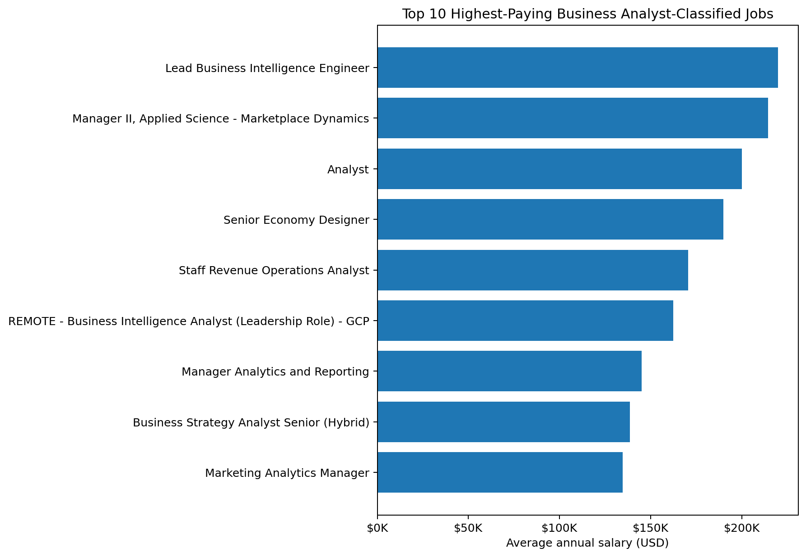
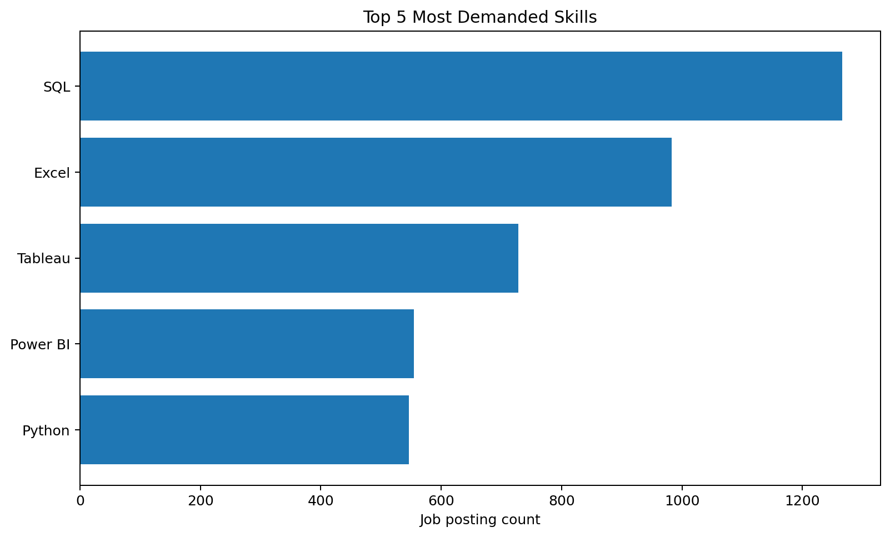
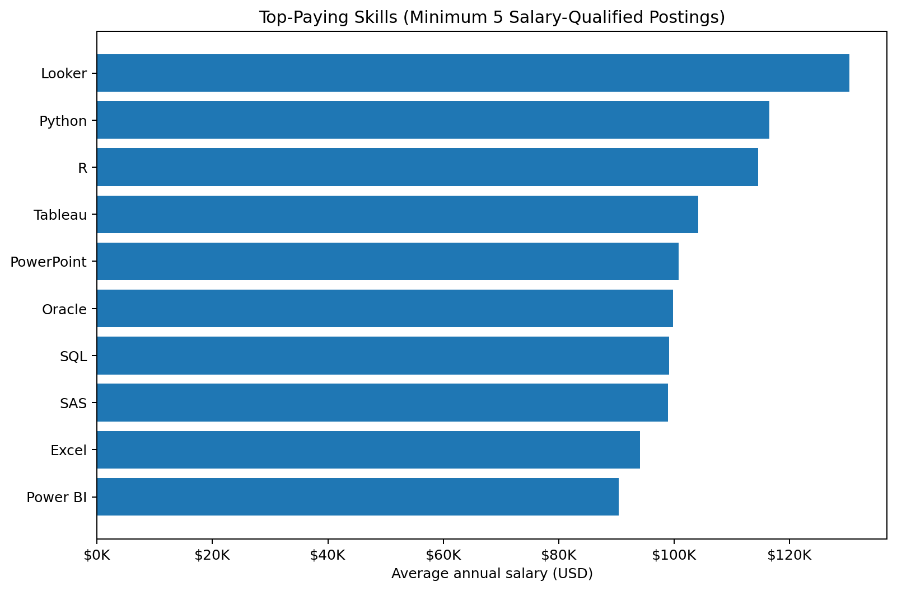
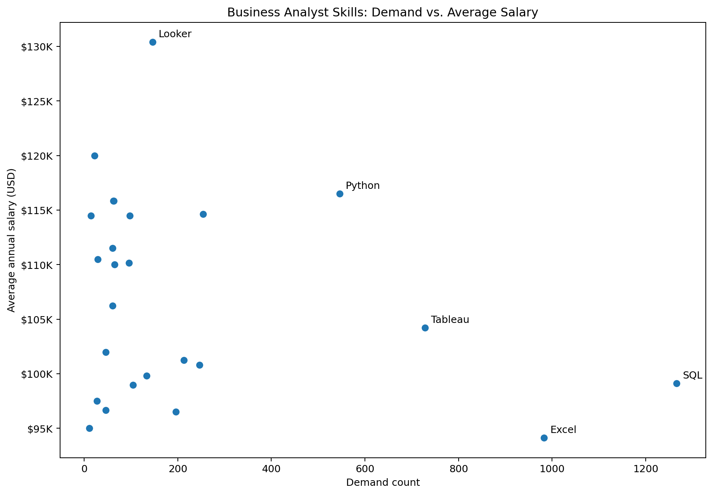

# Business Analyst Job Market Analysis

## Project Overview

This project uses SQL and PostgreSQL to analyze the Business Analyst job
market using job posting data.

The analysis focuses on five business questions:

1.  Which Business Analyst-classified jobs offer the highest salaries?
2.  Which skills appear in the highest-paying jobs?
3.  Which skills are most in demand?
4.  Which skills are associated with higher average salaries?
5.  Which skills provide a strong combination of market demand and
    salary potential?

The goal is to move beyond simply retrieving data and use SQL to
identify patterns that can support career and skill-development
decisions.

## Tools & Technologies

-   **PostgreSQL** --- database management
-   **SQL** --- data extraction, joins, filtering, aggregation, CTEs,
    and analysis
-   **Visual Studio Code** --- query development and database
    interaction
-   **Git & GitHub** --- version control and project sharing
-   **Python / Matplotlib** --- visualization of SQL query outputs

## Project Structure

``` text
project_sql/
├── 1_top_paying_jobs.sql
├── 2_top_paying_jobs_skills.sql
├── 3_top_demanded_skills.sql
├── 4_top_paying_skills.sql
└── 5_optimal_skills.sql

assets/
├── 1_top_paying_jobs.png
├── 3_top_demanded_skills.png
├── 4_top_paying_skills.png
└── 5_demand_vs_salary.png
```

## Dataset & Data Model

The analysis uses job-posting data containing job information, company
information, and skill requirements.

The main tables used are:

-   `job_postings_fact` --- job posting details, salary, location,
    work-from-home status, and job titles
-   `company_dim` --- company information
-   `skills_job_dim` --- relationship between jobs and skills
-   `skills_dim` --- skill names and identifiers

The analysis connects job postings to companies and skills using
relational joins.

## Analysis

### 1. Top-Paying Business Analyst Jobs

**SQL file:** `1_top_paying_jobs.sql`

**Business question:**\
Which Business Analyst-classified jobs have the highest reported annual
salaries among jobs listed as available anywhere?

The query filters for:

-   `job_title_short = 'Business Analyst'`
-   `job_location = 'Anywhere'`
-   non-null annual salary

and returns the top 10 jobs ordered by salary.

### Results

  -------------------------------------------------------------------------
                  Rank Job Title       Company               Average Annual
                                                                     Salary
  -------------------- --------------- --------------- --------------------
                     1 Lead Business   Noom                       \$220,000
                       Intelligence                    
                       Engineer                        

                     2 Manager II,     Uber                       \$214,500
                       Applied                         
                       Science -                       
                       Marketplace                     
                       Dynamics                        

                     3 Analyst         Multicoin                  \$200,000
                                       Capital         

                     4 Analyst         Multicoin                  \$200,000
                                       Capital         

                     5 Senior Economy  Harnham                    \$190,000
                       Designer                        

                     6 Staff Revenue   Gladly                     \$170,500
                       Operations                      
                       Analyst                         

                     7 REMOTE -        CyberCoders                \$162,500
                       Business                        
                       Intelligence                    
                       Analyst                         
                       (Leadership                     
                       Role) - GCP                     

                     8 Manager         CyberCoders                \$145,000
                       Analytics and                   
                       Reporting                       

                     9 Business        USAA                       \$138,640
                       Strategy                        
                       Analyst Senior                  
                       (Hybrid)                        

                    10 Marketing       Get It                     \$134,550
                       Analytics       Recruit -       
                       Manager         Marketing       
  -------------------------------------------------------------------------



### Key insight

The top 10 salaries range from **\$134,550 to \$220,000**. The
highest-paying entries are not limited to conventional "Business
Analyst" titles; the dataset's Business Analyst classification includes
roles in business intelligence, analytics management, revenue
operations, strategy, and applied science.

------------------------------------------------------------------------

### 2. Skills in the Highest-Paying Jobs

**SQL file:** `2_top_paying_jobs_skills.sql`

**Business question:**\
What technical and business tools appear in the highest-paying Business
Analyst-classified jobs?

The query first identifies the top 10 highest-paying jobs and then joins
those jobs to the skills tables.

### Observed skills

The highest-paying roles contain skills including:

-   SQL
-   Python
-   Excel
-   Tableau
-   Looker
-   R
-   SAS
-   BigQuery
-   GCP
-   Word
-   Google Sheets
-   Chef
-   Phoenix

SQL and Python appear repeatedly across the highest-paying roles, while
BI and spreadsheet tools such as Tableau, Excel, and Looker also appear
in several of them.

### Why this matters

A high salary does not appear to be tied to one single skill. The
highest-paying roles often combine analytical skills with business
intelligence, programming, database, or reporting technologies.

------------------------------------------------------------------------

### 3. Most In-Demand Business Analyst Skills

**SQL file:** `3_top_demanded_skills.sql`

**Business question:**\
Which skills are most frequently requested in remote Business Analyst
job postings?

### Results

    Rank Skill        Demand Count
  ------ ---------- --------------
       1 SQL                 1,266
       2 Excel                 983
       3 Tableau               728
       4 Power BI              555
       5 Python                546



### Key insight

**SQL is the most demanded skill**, appearing in 1,266 job-skill
records, followed by Excel at 983 and Tableau at 728.

The result also shows that the Business Analyst market in this dataset
values a combination of:

-   Data querying --- SQL
-   Spreadsheet analysis --- Excel
-   Data visualization --- Tableau and Power BI
-   Programming/analytics --- Python

------------------------------------------------------------------------

### 4. Skills Associated With Higher Average Salaries

**SQL file:** `4_top_paying_skills.sql`

**Business question:**\
Which skills are associated with higher average salaries among remote
Business Analyst postings with reported salaries?

To reduce the effect of extremely rare skills and salary outliers, the
query requires each skill to appear in at least **5 salary-qualified job
postings**.

### Results

    Rank Skill          Demand Count   Average Salary
  ------ ------------ -------------- ----------------
       1 Looker                    5        \$130,400
       2 Python                   20        \$116,516
       3 R                         8        \$114,629
       4 Tableau                  27        \$104,233
       5 PowerPoint                5        \$100,800
       6 Oracle                    6         \$99,830
       7 SQL                      42         \$99,120
       8 SAS                      14         \$98,959
       9 Excel                    31         \$94,132
      10 Power BI                 12         \$90,448



### Key insight

Looker has the highest average salary in this filtered analysis at
**\$130,400**, while Python and R also show relatively high averages.

However, salary alone should not determine which skill to learn. For
example, Looker has only 5 salary-qualified postings in this analysis,
while SQL has 42. This is why the next analysis combines salary and
demand.

------------------------------------------------------------------------

### 5. Skills With Strong Demand and Salary Potential

**SQL file:** `5_optimal_skills.sql`

**Business question:**\
Which skills combine meaningful market demand with relatively strong
average salaries?

The analysis separates:

-   **Demand** --- number of remote Business Analyst job postings
    associated with each skill
-   **Average salary** --- average reported annual salary for remote
    Business Analyst postings requiring the skill

Skills appearing in fewer than 10 job postings are excluded to reduce
the influence of very rare skills.

### Selected results

  Skill         Demand Count   Average Salary
  ----------- -------------- ----------------
  Looker                 146        \$130,400
  MongoDB                 22        \$120,000
  Python                 546        \$116,516
  BigQuery                63        \$115,833
  GCP                     62        \$115,833
  R                      254        \$114,629
  Snowflake               97        \$114,500
  Tableau                728        \$104,233
  SQL                  1,266         \$99,120
  Excel                  983         \$94,132



### Key insight

The analysis highlights a clear trade-off between demand and salary.

-   **SQL** has the highest demand in the analysis but a lower average
    salary than several specialized technologies.
-   **Python** combines substantial demand with a higher average salary.
-   **Tableau** and **Excel** have strong demand, although their average
    salaries are lower than Python and several specialized tools.
-   **Looker** has a high average salary while still appearing in 146
    postings, making it more meaningful than extremely rare high-salary
    skills.

The scatter plot makes this trade-off easier to evaluate than a simple
salary ranking.

------------------------------------------------------------------------

## Key Findings

### 1. SQL is the strongest foundational skill

SQL has the highest demand at **1,266**, significantly ahead of Excel at
983.

### 2. Excel remains highly relevant

Excel is the second-most demanded skill with **983** postings, showing
that spreadsheet analysis remains important alongside SQL.

### 3. BI tools are important for Business Analysts

Tableau appears in **728** postings and Power BI in **555**,
highlighting the importance of reporting and visualization skills.

### 4. Python offers a strong salary-demand combination

Python appears in **546** postings and has an average salary of
**\$116,516** in the salary-qualified analysis.

### 5. High salary does not automatically mean high market value

Some specialized skills have high average salaries but much lower
demand. Looking only at salary can therefore produce misleading
conclusions.

------------------------------------------------------------------------


## Technical Skills Demonstrated

This project demonstrates practical use of:

-   `SELECT`
-   `WHERE`
-   `INNER JOIN`
-   `LEFT JOIN`
-   `GROUP BY`
-   `HAVING`
-   `ORDER BY`
-   `LIMIT`
-   `COUNT()`
-   `COUNT(DISTINCT ...)`
-   `AVG()`
-   `ROUND()`
-   Common Table Expressions (`WITH`)
-   Multi-table relational analysis
-   Aggregation and ranking
-   Business-question-driven SQL analysis

------------------------------------------------------------------------

## Data Limitations

This analysis has several limitations that should be considered when
interpreting the results:

1.  **Job classification:** The dataset classifies several roles under
    `Business Analyst` even when the displayed job titles include roles
    such as Business Intelligence Engineer, Applied Science Manager, and
    Analytics Manager. The results therefore represent the dataset's
    Business Analyst classification rather than a manually verified list
    of conventional Business Analyst roles.

2.  **Salary availability:** Salary analysis only includes postings with
    a non-null `salary_year_avg`. Jobs without reported salaries are
    excluded from salary calculations.

3.  **Remote filtering:** Several analyses use
    `job_work_from_home = TRUE`, while the top-paying-jobs analysis uses
    `job_location = 'Anywhere'`. These are related but not identical
    filters.

4.  **Association, not causation:** A skill being associated with a
    higher average salary does not prove that the skill itself causes
    higher compensation.

5.  **Rare skills:** Minimum demand thresholds are used in the
    salary-focused analyses to reduce the influence of skills appearing
    in only a handful of postings.

6.  **Market scope:** The salary figures are reported in USD and reflect
    the dataset used for this project. They should not be interpreted as
    current salary expectations for every Business Analyst market.

------------------------------------------------------------------------

## Conclusion

This project uses SQL to analyze the Business Analyst job market from
multiple angles: compensation, skill requirements, demand, and the
relationship between demand and salary.

The strongest overall pattern is that **SQL, Excel, Tableau, Power BI,
and Python** form an important part of the skill landscape in the
analyzed postings.

The analysis also shows why looking at only one metric can be
misleading. A skill can have a high average salary but limited demand,
while another can have very high demand but a more moderate salary.
Combining both dimensions provides a more useful framework for deciding
which skills deserve priority.

The project demonstrates how SQL can be used not only to retrieve data,
but also to answer business questions and turn raw job-posting data into
actionable insights.
